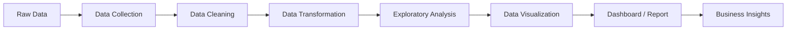
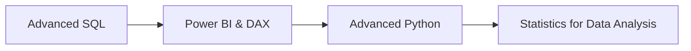

<div align="center">

<!-- Typing animation header -->


<br/>


</div>

---

### 🚀 About Me

```python
class DataAnalyst:
    def __init__(self):
        self.name = "Mohammed Tajamul Hussain"
        self.role = "Data Analyst"
        self.skills = ["Python", "SQL", "Excel", "Power BI"]
        self.focus = ["Data Cleaning", "EDA", "Visualization", "Reporting"]
        self.mission = "Turn raw data into meaningful business decisions"

    def currently_learning(self):
        return ["Advanced SQL", "DAX", "Advanced Python", "Statistics"]
```

- 🔹 Passionate about **Data Analytics** and **Business Intelligence**
- 🔹 Skilled in **Python, SQL, Excel, and Power BI**
- 🔹 Focused on data cleaning, exploratory analysis, visualization & reporting
- 🔹 Building real-world analytics projects to solve business problems
- 🔹 Always learning new tools and techniques in the data space

---

### 📫 Connect With Me

<p align="center">
  <a href="www.linkedin.com/in/mdtajamulhussain" target="_blank">
    
  </a>
  <a href="mailto:tajamul1099@gmail.com">
    
  </a>
  <a href="#" target="_blank">
    
  </a>
</p>

---

### 🛠️ Technical Skills

<details open>
<summary><b>📊 Data Analytics</b></summary>
<br/>

**Data Preparation**
`Data Cleaning` `Data Wrangling` `Data Transformation` `Missing Value Treatment` `Outlier Detection`

**Analysis**
`Exploratory Data Analysis (EDA)` `Statistical Analysis` `Hypothesis Testing` `Trend Analysis`

**Reporting & Insights**
`Data Visualization` `Business Reporting` `KPI Analysis` `Dashboarding` `Root Cause Analysis`

</details>

<details open>
<summary><b>🐍 Python</b></summary>
<br/>

`Pandas` `NumPy` `Matplotlib` `Seaborn` `Jupyter Notebook`

</details>

<details open>
<summary><b>🗄️ SQL</b></summary>
<br/>

| Category | Commands |
|---|---|
| **DDL** (Data Definition Language) | `CREATE` `ALTER` `DROP` `TRUNCATE` |
| **DML** (Data Manipulation Language) | `INSERT` `UPDATE` `DELETE` |
| **DQL** (Data Query Language) | `SELECT` |
| **DCL** (Data Control Language) | `GRANT` `REVOKE` |
| **TCL** (Transaction Control Language) | `COMMIT` `ROLLBACK` `SAVEPOINT` |

**Query Techniques:** `JOINS` `SUBQUERIES` `CTEs` `WINDOW FUNCTIONS` `CASE WHEN` `AGGREGATE FUNCTIONS`

</details>

<details open>
<summary><b>📈 Visualization & BI</b></summary>
<br/>

`Power BI` `Excel` `Power Query` `Pivot Tables` `DAX` `Interactive Dashboards`

</details>

---

### 📂 Featured Projects

<table>
<tr>
<td width="50%" valign="top">

**📊 Sales Analytics Dashboard**
`Power BI` `Excel` `SQL`

Analyzed sales performance to identify:
- Revenue trends
- Top-performing products
- Regional performance
- Salesperson performance
- Monthly & yearly KPIs

[🔗 View Project](#)

</td>
<td width="50%" valign="top">

</td>
</tr>
</table>

---

### 📈 My Analytics Workflow



---

### 💡 What I Can Do

| Area | Skills |
|---|---|
| 📊 Data Analysis | EDA, KPIs, Trend Analysis |
| 🐍 Python | Pandas, NumPy, Data Visualization |
| 🗄️ SQL | Joins, CTEs, Window Functions |
| 📈 Power BI | Dashboards, DAX, Power Query |
| 📑 Excel | VLOOKUP, XLOOKUP, Pivot Tables |
| 📉 Visualization | Charts, Reports, Dashboards |

---

### 🎯 Currently Learning


---

### ⚡ Fun Fact

> I enjoy turning messy datasets into clean dashboards and useful business insights. 📊

---

<div align="center">

⭐ **If you find my projects useful, consider giving them a star!**

**Thanks for visiting my profile! 🚀**


</div>
